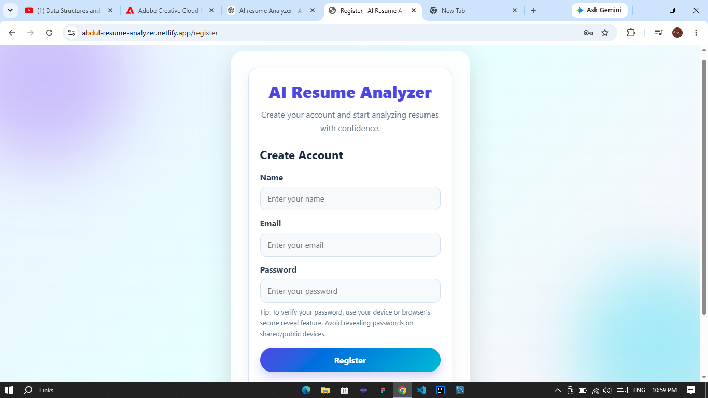
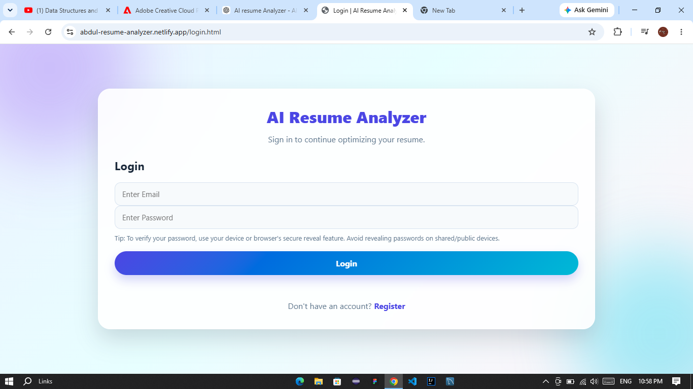
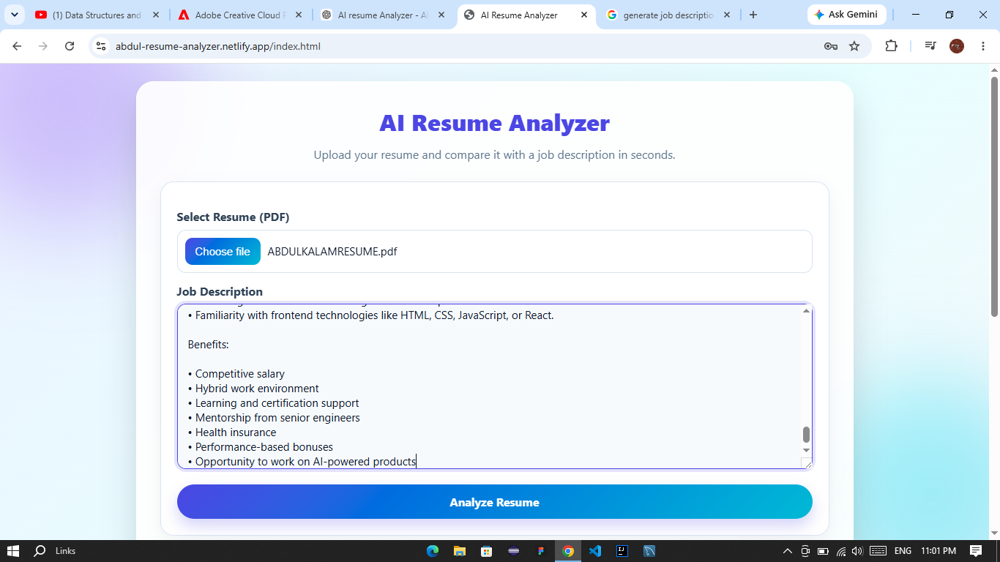
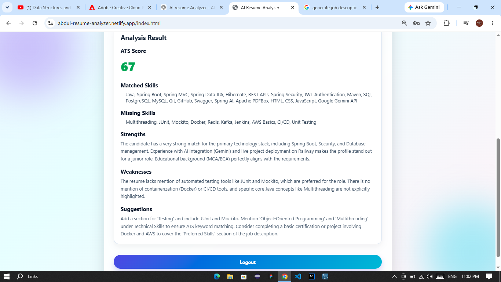

# 🤖 AI Resume Analyzer

An AI-powered Resume Analyzer that compares a candidate's resume with a job description using **Google Gemini AI** and provides an ATS score, matched skills, missing skills, strengths, weaknesses, and personalized improvement suggestions.


---

## 🚀 Live Demo

🌐 **Frontend**

https://abdul-resume-analyzer.netlify.app

📚 **Swagger Documentation**

https://ample-patience-production-077f.up.railway.app/swagger-ui/index.html

---

# ✨ Features

- 🔐 Secure User Registration & Login
- 🔑 JWT Authentication
- 📄 Upload Resume (PDF)
- 📝 Enter Job Description
- 🤖 AI Resume Analysis using Google Gemini
- 📊 ATS Score Generation
- ✅ Matched Skills Detection
- ❌ Missing Skills Detection
- 💪 Resume Strength Analysis
- ⚠️ Weakness Identification
- 💡 AI Suggestions to Improve Resume
- ☁️ Cloud Deployment
- 📖 Swagger API Documentation

---

# 🛠 Tech Stack

## Backend

- Java 21
- Spring Boot
- Spring Security
- Spring AI
- Google Gemini API
- Spring Data JPA
- PostgreSQL
- JWT
- Maven
- Apache PDFBox
- Swagger/OpenAPI

## Frontend

- HTML5
- CSS3
- JavaScript
- Axios

## Database

- Neon PostgreSQL

## Deployment

- Railway
- Netlify

---

# 📸 Application Screenshots

## 🔹 User Registration



---

## 🔹 User Login



---

## 🔹 Resume Upload & Job Description



---

## 🔹 AI Analysis Result



---

# ⚙️ How It Works

1. Register a new account.
2. Login securely using JWT Authentication.
3. Upload a resume in PDF format.
4. Paste the target Job Description.
5. The application extracts resume text using Apache PDFBox.
6. Google Gemini compares the resume with the Job Description.
7. The application displays:
   - ATS Score
   - Matched Skills
   - Missing Skills
   - Strengths
   - Weaknesses
   - Improvement Suggestions

---

# 📂 Project Structure

```
AI-Resume-Analyzer
│
├── Backend
│   ├── Controller
│   ├── Service
│   ├── Repository
│   ├── Model
│   ├── JWT
│   ├── Security
│   ├── Util
│   └── Resources
│
└── Frontend
    ├── HTML
    ├── CSS
    ├── JavaScript
    └── Assets
```

---

# ⚡ REST APIs

| Method | Endpoint | Description |
|---------|----------|-------------|
| POST | `/user/register` | Register User |
| POST | `/user/login` | Login |
| POST | `/resume/user/{userId}/upload` | Upload Resume |
| POST | `/jd/add` | Add Job Description |
| POST | `/analysis/{resumeId}/{jdId}` | Analyze Resume |

---

# 🔧 Installation

## Clone Repository

```bash
git clone https://github.com/abdul6853/AI-Resume-Analyzer.git
cd AI-Resume-Analyzer
```

---

## Configure Environment

```properties
spring.datasource.url=YOUR_DATABASE_URL
spring.datasource.username=YOUR_DATABASE_USERNAME
spring.datasource.password=YOUR_DATABASE_PASSWORD

spring.ai.google.genai.api-key=YOUR_GEMINI_API_KEY

jwt.secret=YOUR_SECRET_KEY
```

---

## Run Backend

```bash
./mvnw spring-boot:run
```

---

## Frontend

Update API URL

```javascript
const API_URL = "https://ample-patience-production-077f.up.railway.app";
```

Run using Live Server or any static web server.

---

# 📖 Swagger

```
https://ample-patience-production-077f.up.railway.app/swagger-ui/index.html
```

---

# 🚀 Future Enhancements

- Resume History
- AI Cover Letter Generator
- Resume PDF Export
- Resume Templates
- AI Interview Question Generator
- Skill Gap Visualization
- Dashboard Analytics
- Multi-language Resume Support

---

# 👨‍💻 Author

**Abdul Kalam**

**GitHub**

https://github.com/abdul6853

**LinkedIn**

https://www.linkedin.com/in/abdul-kalam9742

---

# ⭐ Support

If you found this project helpful, consider giving it a **⭐ Star** on GitHub.

Feedback and contributions are always welcome!
